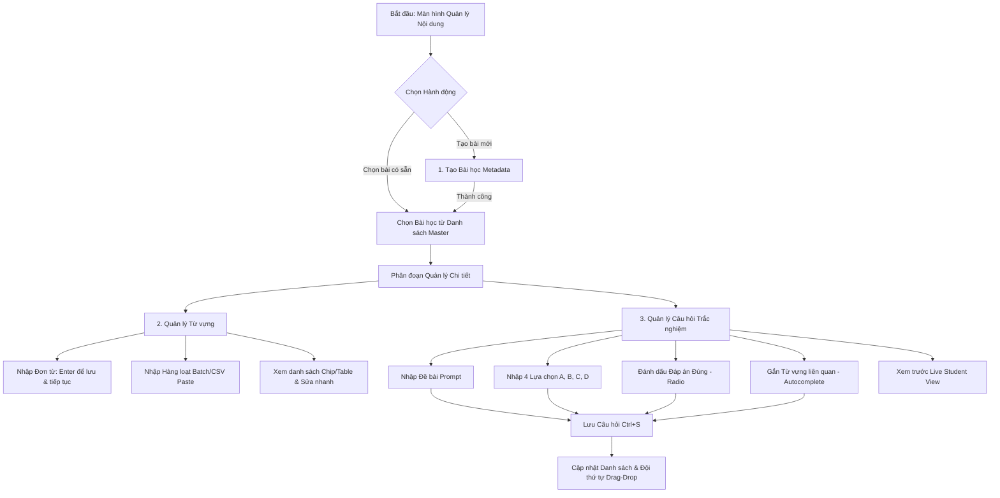

# THIẾT KẾ TRẢI NGHIỆM NGUỜI DÙNG (UX SPECIFICATION)
## LUỒNG TẠO BÀI TẬP, CÂU HỎI VÀ TỪ VỰNG (EDTECH CONTENT CREATION WORKFLOW)

> **Tài liệu Kỹ thuật UX**: Content Management & Creation UX Specification  
> **Dự án**: KITS Project - Study Tool (Korean Learning Platform)  
> **Áp dụng cho**: `apps/web/src/pages/manage-content-page.tsx` và các UI Components liên quan  
> **Vị trí tài liệu**: `docs/UIspec/UX_content_management_flow.md`  
> **Ngày khởi tạo**: 2026-08-26  

---

## 1. TỔNG QUAN LUỒNG UX QUẢN LÝ NỘI DUNG (UX ARCHITECTURE)

Trong ứng dụng giáo dục, **người tạo nội dung (Giáo viên / Content Manager)** cần nhập và chỉnh sửa hàng trăm từ vựng, câu hỏi trắc nghiệm mỗi ngày. Mọi sự chậm trễ trong thao tác, lỡ tay mất dữ liệu, hoặc giao diện phức tạp đều gia tăng **Tải trọng Nhận thức (Extraneous Cognitive Load)**.

### 1.1. Mục Tiêu UX Cốt Lõi (Core UX Goals)
1. **Tốc độ Nhập Dữ Liệu Tối Đa (Fast Data Entry)**: Cho phép nhập nhanh từ vựng bằng phím bấm (`Enter`, `Tab`), không yêu cầu chuyển đổi giữa Chuột và Bàn phím liên tục.
2. **Loại Bỏ Rủi Ro Mất Dữ Liệu (Zero Data Loss)**: Tự động lưu nháp (`Auto-save Draft` vào LocalStorage), cảnh báo trực quan khi có thay đổi chưa lưu (`Unsaved Changes Warning`).
3. **Phản Hồi Trực Quan Tức Thì (Live Preview)**: Xem trước giao diện hiển thị phía Học viên (Student View) ngay trong quá trình biên soạn câu hỏi.
4. **Giảm Thao Tác Trùng Lặp**: Hỗ trợ Nhập hàng loạt (Batch CSV/Text Paste), Nhận diện trùng lặp (Duplicate Detection), và Nhân bản câu hỏi (Duplicate Question).

### 1.2. Sơ Đồ Tiến Trình Người Dùng (User Flow Diagram)



---

## 2. LUỒNG 1: UX TẠO VÀ QUẢN LÝ BÀI TẬP / BÀI HỌC (LESSON CREATION FLOW)

Bài học (`Lesson`) là đơn vị chứa (Container) chứa toàn bộ từ vựng và câu hỏi trắc nghiệm liên quan.

### 2.1. Cấu Trúc Bố Cục Master-Detail (Two-Column Layout)
* **Cột Trái (Master List - 30% Width, Sticky)**:
  * Thanh tìm kiếm nhanh bài học theo tên (`Search Input`).
  * Nút Primary `+ Bài học mới` luôn cố định trên cùng.
  * Danh sách thẻ bài học gọn nhẹ, hiển thị badge tổng số từ (`vocabCount`) và câu hỏi (`questionCount`).
  * Trạng thái active có chỉ số thị giác Indigo thanh thoát (`bg-indigo-50` / `border-indigo-600`).
* **Cột Phải (Detail Workspace - 70% Width)**:
  * Form cấu hình bài học + Tabs phân tách rõ ràng: **[1. Từ vựng]** - **[2. Câu hỏi trắc nghiệm]** - **[3. Cài đặt bài học]**.

### 2.2. Chi Tiết Tương Tác Tạo Bài Học
1. **Form Input Bắt Buộc**:
   * **Tên bài học (`Name`)**: Input single-line, `maxLength=120`, tự động focus vào ô này khi nhấn `+ Bài học mới`.
   * **Mô tả bài học (`Description`)**: Textarea 3 dòng, `maxLength=1000`, hiển thị bộ đếm ký tự còn lại dạng vi mô (`112/120` ký tự).
2. **Phản hồi trạng thái (Feedback States)**:
   * **Đang lưu (`Saving State`)**: Nút bấm chuyển sang trạng thái `Disabled` kèm Spinner xoay nhẹ + Text *"Đang lưu..."*.
   * **Lưu thành công (`Success Toast`)**: Banner thông báo màu Emerald nhẹ (`bg-emerald-50 text-emerald-800`) tự ẩn sau 3 giây.
   * **Lỗi validation**: Viền đỏ Rose (`border-rose-500`) quanh ô lỗi kèm dòng chữ báo nguyên nhân cụ thể bên dưới ô input.

### 2.3. Quy Trình Xóa An Toàn (Safety UX for Deletion)
Xóa bài học sẽ xóa toàn bộ từ vựng và câu hỏi liên quan.
* **Không dùng `window.confirm()` mặc định trình duyệt** (kém chuyên nghiệp và dễ vô tình nhấn Enter).
* **Sử dụng Safe Confirmation Modal**:
  * Tiêu đề: *"Xóa bài học 'Từ vựng TOPIK I'?"*
  * Cảnh báo màu Rose: *"Hành động này sẽ xóa vĩnh viễn 15 từ vựng và 10 câu hỏi trắc nghiệm. Không thể khôi phục."*
  * Yêu cầu xác nhận: Người dùng phải gõ chữ **`XÓA`** hoặc chọn Nút *"Tôi hiểu, xóa bài học"* với đếm ngược 3 giây mới được kích hoạt.

---

## 3. LUỒNG 2: UX TẠO VÀ QUẢN LÝ TỪ VỰNG (VOCABULARY FLOW)

Nền tảng học ngôn ngữ đòi hỏi quy trình nhập từ vựng cực kỳ nhanh chóng và chính xác.

### 3.1. Chế Độ 1: Nhập Đơn Tự Động Nối Tiếp (Fast Single Entry Mode)
* **Giao diện**: Form 2 ô song song: `[ Từ tiếng Hàn (Word) ]` - `[ Nghĩa tiếng Việt (Meaning) ]`.
* **Quy tắc phím bấm (Keyboard Synergy)**:
  1. Nhập từ tiếng Hàn -> Nhấn `Tab` -> Chuyển sang ô Nghĩa.
  2. Nhập nghĩa tiếng Việt -> Nhấn `Enter` -> Tự động gọi API thêm từ, hiển thị từ vừa thêm vào danh sách bên dưới.
  3. Con trỏ tự động nhảy về ô `Từ tiếng Hàn` và xóa trắng input để sẵn sàng nhập từ tiếp theo.
* **Phát âm thử (Pronunciation Audio Test)**: Icon loa bên cạnh ô từ tiếng Hàn cho phép nghe phát âm chuẩn qua Web Speech Synthesis API ngay khi nhập.

```
[ Input: 안녕하세요 (Word) ] --Tab--> [ Input: Xin chào (Meaning) ] --Enter--> [ Auto-Add & Clear ]
                                                                                   ↓
                                                                      Focus quay về Input Word
```

### 3.2. Chế Độ 2: Nhập Hàng Loạt (Batch CSV / Text Paste Import)
Dành cho giáo viên có sẵn danh sách từ vựng trong Excel / Google Sheets.
* **Nút chuyển đổi**: Nút `[ 📋 Nhập hàng loạt ]` bên cạnh form nhập đơn.
* **Khu vực Paste**: Ô Textarea rộng lớn cho phép dán trực tiếp dữ liệu phân tách bằng dấu phẩy, dấu tab hoặc dấu gạch ngang (VD: `안녕 - Xin chào`).
* **Bảng Xem Trước (Import Preview Table)**:
  * Hệ thống tự động parse danh sách thành bảng 2 cột: `Từ vựng` | `Nghĩa`.
  * Đánh dấu màu vàng Amber đối với các từ **đã tồn tại trong bài học** (Cảnh báo trùng lặp).
  * Nút CTA `[ Xóa các từ trùng & Nhập 25 từ ]`.

### 3.3. Hiển Thị Danh Sách Từ Vựng & Inline Edit
* **Dạng hiển thị Chip List / Data Table**:
  * Mỗi từ vựng hiển thị dưới dạng Card/Chip nhỏ gồm: `Từ tiếng Hàn` (Bold) - `Nghĩa` (Slate Muted) - Nút Xóa nhanh (`✕`).
* **Sửa nhanh tại chỗ (Inline Edit)**: Double click vào từ vựng bất kỳ sẽ chuyển từ đó sang chế độ ô nhập liệu trực tiếp, nhấn `Enter` hoặc click ra ngoài để lưu thay đổi.

---

## 4. LUỒNG 3: UX TẠO VÀ QUẢN LÝ CÂU HỎI TRẮC NGHIỆM (QUESTION / MCQ FLOW)

Màn hình tạo câu hỏi đòi hỏi sự chính xác cao về mặt ngữ nghĩa và đáp án đúng.

### 4.1. Form Biên Soạn Câu Hỏi Tương Tác
* **Đề bài (`Prompt`)**: Textarea 2 dòng. Hỗ trợ chèn từ vựng tiếng Hàn nhanh từ danh sách bài học qua nút `[ + Chèn từ vựng ]`.
* **4 Lựa chọn Đáp án (Options A, B, C, D)**:
  * Lưới 2x2 ô nhập đáp án.
  * Mỗi ô đáp án tích hợp một **Radio Button (Hoặc Nút Check màu Emerald)** đặt phía trước để đánh dấu đó là **Đáp án Đúng (`correctOptionIndex`)**.
  * Khi nhấn chọn Radio button của Lựa chọn B, toàn bộ ô B đổi sang viền Emerald Green tươi (`border-emerald-500 bg-emerald-50/50`) kèm nhãn `[✓ Đáp án đúng]`.

```
Đề bài: Chọn nghĩa đúng của từ "감사합니다":
+-----------------------------------------------------------------------+
| (•) A. Cảm ơn (Đáp án đúng)          | ( ) B. Xin chào                 |
|     [ Input: Cảm ơn             ]  |     [ Input: Xin chào           ]  |
+-----------------------------------------------------------------------+
| ( ) C. Tạm biệt                      | ( ) D. Xin lỗi                  |
|     [ Input: Tạm biệt           ]  |     [ Input: Xin lỗi            ]  |
+-----------------------------------------------------------------------+
```

* **Gắn Từ Vựng Liên Quan (`Vocabulary Link`)**:
  * Dropdown Select cho phép liên kết câu hỏi với 1 từ vựng cụ thể trong bài học.
  * Khi học viên trả lời sai câu hỏi này, thuật toán Spaced Repetition của `analytics-service` sẽ tự động đánh dấu chính xác từ vựng đó cần được ôn lại.

### 4.2. Xem Trước Trực Tiếp (Live Student Preview)
* Một Panel phụ thu nhỏ ở góc phải form biên soạn mô phỏng màn hình điện thoại/máy tính của Học viên.
* Mỗi khi Giáo viên gõ chữ hoặc thay đổi đáp án đúng, màn hình Preview **cập nhật thời gian thực (Real-time update)**:
  * Giúp Giáo viên kiểm tra ngay lập tức: Chữ tiếng Hàn có bị tràn dòng không? Đáp án A B C D có bị quá dài không?

### 4.3. Quản Lý Danh Sách Câu Hỏi & Nhân Bản (Duplicate)
* **Số thứ tự tự động**: Danh sách câu hỏi hiển thị dạng Cards kéo dài, có đánh số thứ tự `Câu 1`, `Câu 2`, `Câu 3`...
* **Nhân bản nhanh (`Duplicate Question`)**: Nút `📋 Nhân bản` giúp sao chép toàn bộ Đề bài và 4 Đáp án hiện tại tạo thành câu hỏi mới. Rất hữu ích khi giáo viên muốn tạo một chuỗi câu hỏi có cấu trúc tương tự nhau.
* **Đổi thứ tự (Drag & Drop Reordering)**: Thao tác kéo thả icon 6 chấm (`⋮⋮`) ở đầu mỗi câu hỏi để sắp xếp lại thứ tự xuất hiện khi học viên làm bài.

---

## 5. BỘ QUY TẮC VI TƯƠNG TÁC VÀ ACCESSIBILITY (MICRO-INTERACTIONS & A11Y)

### 5.1. Phím Tắt Tối Ưu Tốc Độ Biên Soạn (Keyboard Shortcuts)

| Phím tắt | Hành động UX |
| :--- | :--- |
| **`Ctrl + S` / `Cmd + S`** | Lưu Bài học / Lưu Câu hỏi đang biên soạn mà không cần di chuột tới nút Save. |
| **`Esc`** | Hủy chế độ chỉnh sửa câu hỏi, quay về form thêm mới. |
| **`Ctrl + Shift + D`** | Nhân bản câu hỏi đang chọn. |
| **`Tab` / `Shift + Tab`** | Di chuyển tuần tự qua các ô Input: Prompt -> Answer A -> Answer B -> Answer C -> Answer D -> Save. |

### 5.2. Tự Động Lưu Nháp (Auto-Save Draft & Unsaved Warning)
* Mỗi khi thay đổi nội dung trên form mà chưa nhấn "Lưu", ứng dụng tự động ghi dữ liệu nháp vào `localStorage` (`draft-question-{lessonId}`).
* Nếu Giáo viên vô tình chuyển sang trang khác hoặc nhấn F5, hệ thống hiển thị thông báo khôi phục: *"Bạn có một câu hỏi đang soạn dở. Bạn có muốn khôi phục không?"*.

### 5.3. Tiêu Chuẩn Truy Cập (WCAG 2.1 AA Compliance)
* Mọi Radio Button chọn đáp án đúng bắt buộc có `aria-label="Đánh dấu lựa chọn A là đáp án đúng"`.
* Mọi nút Xóa / Sửa trong danh sách đều có `aria-label` chứa tên câu hỏi/từ vựng cụ thể (Ví dụ: `aria-label="Xóa câu hỏi 3: Từ 감사합니다 có nghĩa là gì"`).
* Đảm bảo tương phản màu chữ đạt chuẩn tối thiểu 4.5:1 cả trên Light Mode và Dark Mode.

---

## 6. DANH SÁCH COMPONENT CẦN NÂNG CẤP TRONG CODEBASE (`apps/web`)

Dựa trên bản tả UX trên, các component sau trong `apps/web/src` cần được nâng cấp:

- [ ] **`ManageContentPage.tsx`**:
  - Chuyển đổi layout sang Tabs **[Từ vựng]** / **[Câu hỏi]**.
  - Tích hợp phím bấm `Enter` tự động chuyển ô khi nhập từ vựng.
  - Bổ sung đếm ký tự remaining cho Input/Textarea.
- [ ] **`VocabBatchImportModal.tsx` [Component mới]**: Modal hỗ trợ paste danh sách từ vựng và xem trước bảng parse trước khi dán vào bài học.
- [ ] **`QuestionLivePreview.tsx` [Component mới]**: Component hiển thị preview câu hỏi trắc nghiệm theo thời gian thực phía bên phải form.
- [ ] **`SafeDeleteModal.tsx` [Component mới]**: Modal xác nhận xóa an toàn thay thế `window.confirm()`.
- [ ] **`app.css`**: Thêm animation chuyển đổi tab, hiệu ứng highlight ô đáp án đúng (Emerald border pulse) và hiệu ứng hover mượt cho danh sách bài học.

---
Tài liệu này xác lập **chuẩn mực trải nghiệm người dùng (UX)** chi tiết cho toàn bộ luồng tạo và quản lý bài học, từ vựng, câu hỏi trắc nghiệm, phục vụ trực tiếp cho khâu nâng cấp giao diện Web client sản xuất.
